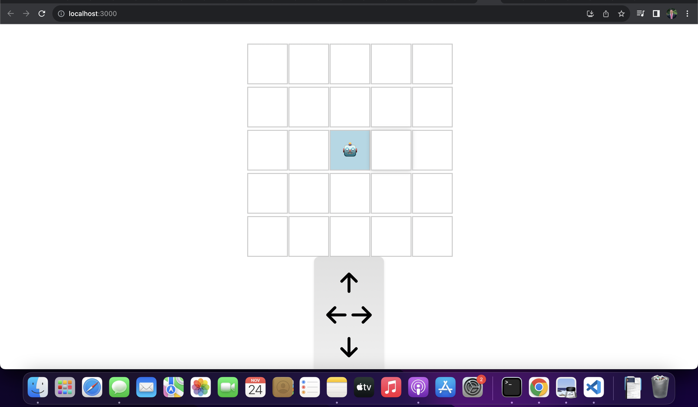

# Robot movement Simulator
Install dependencies
### npm i 
In the project directory, you can run:

### `npm run start`

Runs the app in the development mode.\
Open [http://localhost:3000](http://localhost:3000) to view it in the browser.

To run tests:

### `npm run test`

### Screenshot

